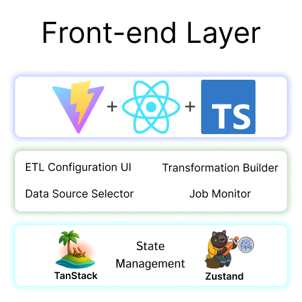

# simple-ETL
Simple ETL tool that makes ETL process easier, no-code like 

## System Architecture

### Front-end layer
#### **React + TypeScript**
- Modern UI with Vite
#### **Components**
- ETL Configuration UI
- Data Source Selector
- Transformation Builder
- Job Monitor
#### **State Management**
- TanStack Query 
- Zustand